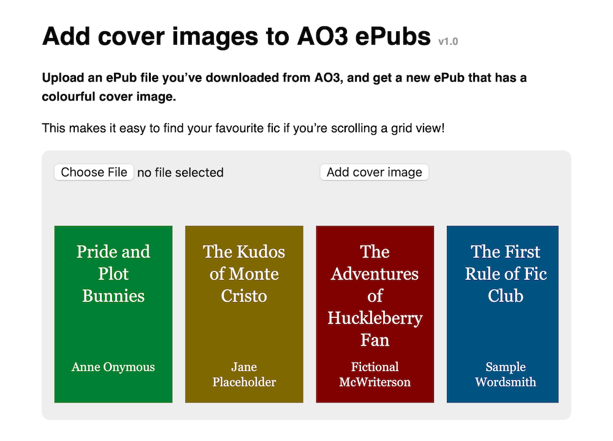

# Add cover images to ePubs from AO3

This tool lets you add a colourful cover image to an ePub file you’ve downloaded from AO3.
This makes it easy to find your favourite fic if you’re scrolling a grid view.

## Development

To run tests:

1.  Start a local web server in this folder (e.g. `python3 -m http.server 4343`)
2.  Open the file `tests.html` as served by that web server

This will run unit tests in the browser using QUnit.
This is because the app runs in the browser, and certain things (e.g. `<canvas>`) are much easier to test in a real browser environment than anywhere else.
You need to use an HTTP server rather than opening the file because it needs to fetch some ZIP files, and that doesn't work over `file://`.

## Deployment

Run the `build.py` script to create the version of the site for deployment.

This inlines the two JavaScript files, so we get a single HTML file which contains the entire tool.
